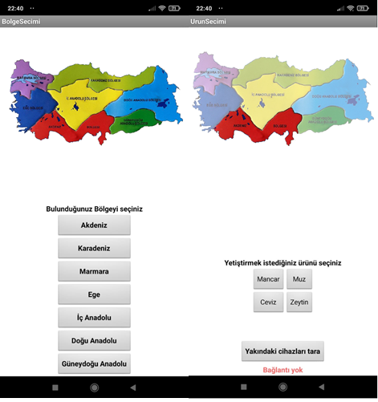

# Farmer

# Farmer
Lisans eğitimi sürecinde bitirme projesi olarak hazırlanmış bir projedir. Elektronik kısmın kodlaması arduino üzerinden yapılmıştır. Mobil uygulama üzerinden elektronik devreye bağlantı sağlanarak yetiştirilmek istenilen ürün seçilir. Ürün için gerekli sulama miktarı arduino içerisine eklenmiştir. Seçilen ürüne göre sulama otomatik başlayacaktır. 

Projenin elektronik şeması şekildeki gibidir.
  

Öncelikle bluetooth bağlantısı yapılır. Daha sonra Ürün seçimi ekranından istenilen ürün seçilir. 

  

Seçim yapıldıktan elektronik devre harekete geçer ve sulama işlemi gerekli zamanda başlar ve daha sonra durur. Devre sürekli çalışır halde kaldığı için sulama gerekli zamanlarda çalışmaya devam eder.
